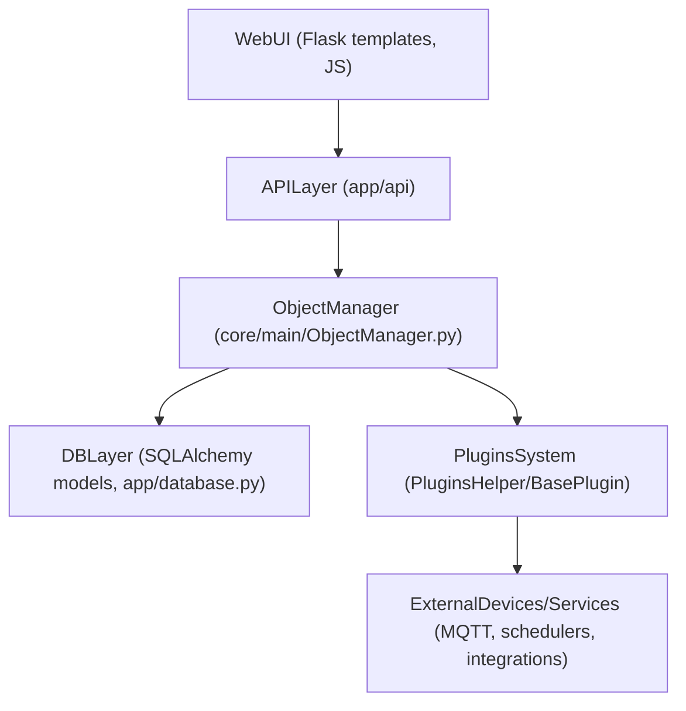
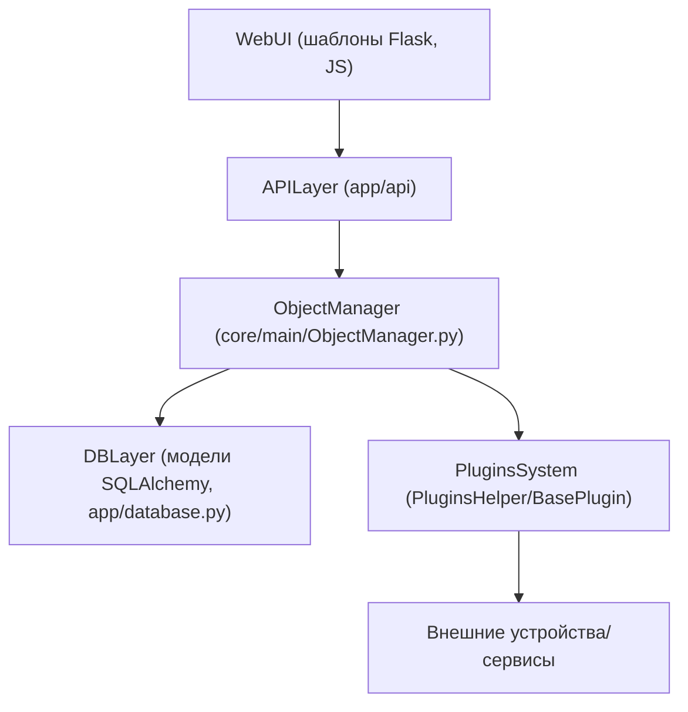

## osysHome architecture (EN)

This document explains the high‑level architecture of osysHome: main components, data flow, and key terms.

---

### 1. High‑level diagram

**WebUI**

- Flask templates under `app/templates/` (`layouts`, `control_panel.html`, admin pages, etc.).
- Static assets under `app/static/` (CSS, JS, images).
- Uses translations from `app/translations/*.json` and plugin translations.

**API layer**

- Blueprint `api_blueprint` from `app/api/__init__.py`.
- Endpoints grouped by domain:
  - `app/api/objects/endpoints.py` — CRUD for objects.
  - `app/api/properties/endpoints.py` — CRUD for properties and values.
  - `app/api/methods/endpoints.py` — calling object methods.
  - `app/api/plugins/endpoints.py` — plugins metadata.
  - `app/api/sql/endpoints.py`, `app/api/utils/endpoints.py`, etc.

**ObjectManager (core)**

- `app/core/main/ObjectManager.py`
  - `ObjectManager` — in‑memory wrapper around DB model `Object` with:
    - `properties: dict[str, PropertyManager]`
    - `methods: dict[str, MethodManager]`
  - `PropertyManager`:
    - Handles decoding/encoding values.
    - Applies validation based on `params` (see `PARAMS_DOCUMENTATION.md`).
    - Manages history via `History` model and `BatchWriter`.
  - `BatchWriter` — asynchronous writer that batches value/history updates for performance.
- Helper functions in `app/core/lib/object.py` (not shown here) expose friendly API:
  - `getObject`, `setProperty`, `updateProperty`, `getObjectsByClass`, etc.

**Database layer**

- SQLAlchemy models in `app/core/models/*.py`:
  - `Object`, `Property`, `Value`, `History`, `Users`, `Plugins`, etc.
- `app/database.py`
  - Session management (`session_scope` context manager).
  - DB initialization and migrations helpers (`sync_db`).

**Plugins system**

- `app/core/main/BasePlugin.py`
  - Base class for all plugins.
  - Creates Flask `Blueprint` for each plugin with:
    - templates in `plugins/<Name>/templates`
    - static files in `plugins/<Name>/static`
  - Handles:
    - plugin config loading/saving from DB (`Plugin` model),
    - background threads (`cycle` action),
    - WebSocket integration (`sendDataToWebsocket`),
    - admin routes (`/admin/<PluginName>`).
- `app/core/main/PluginsHelper.py`
  - Scans `plugins/` directory, imports plugins, calls `initialization`, starts/stops plugins.
  - Manages plugin lifecycle during app start/stop (`start_plugins`, `stop_plugins`).

**External devices/services**

- Implemented mainly in external plugin repositories:
  - `osysHome-Modules`
  - `osysHome-Objects`
  - `osysHome-Users`
  - `osysHome-Scheduler`
  - `osysHome-wsServer`
  - `osysHome-Dashboard`
- Each plugin talks to MQTT, hardware, schedulers, etc., and exposes data to osysHome via:
  - object properties,
  - plugin widgets,
  - REST endpoints, websockets, and UI pages.

---

### 2. Request flow example

1. User opens a dashboard page in the browser.
2. Flask view (from `admin` or plugin blueprint) renders `control_panel.html`.
3. Template uses:
   - data from `ObjectManager` (e.g. widgets, objects),
   - translations via `_()` from `app/__init__.py`.
4. When a property is changed (via UI or API):
   - Web request hits `app/api/properties/endpoints.py`.
   - API finds corresponding `ObjectManager` instance.
   - Calls `ObjectManager.setProperty` / `updateProperty`:
     - `PropertyManager._decodeValue` validates type and `params`.
     - value/history updates are queued in `BatchWriter`.
     - linked plugins (`actions="proxy"` or `linked` properties) are notified.
   - Response is returned to the client.

---

### 3. Key terms (glossary EN)

- **Object** — logical entity in the system (e.g. `Light1`, `Thermostat`, `User.Admin`).
- **Property** — attribute of an object with type, value and validation (e.g. `state`, `temperature`, `brightness`).
- **Method** — executable action associated with an object (script code run via `callMethod`).
- **Class** — template/definition for objects with common properties/methods.
- **Plugin** — extension package in `plugins/` that can:
  - add UI pages,
  - create/manage objects,
  - run background tasks,
  - expose widgets to the dashboard.
- **Dashboard** — main panel with widgets (usually from `osysHome-Dashboard` and other plugins).
- **Scheduler** — plugin that can run delayed or periodic tasks (see `osysHome-Scheduler`).
- **History** — time series of property values stored in the `History` table.
- **BatchWriter** — component that efficiently flushes value/history updates to the DB.

---

## Архитектура osysHome (RU)

Ниже — краткий обзор на русском. Основной, более детальный текст приведён в английской части выше, чтобы избежать дублирования.

### 1. Общая схема

- **WebUI** — шаблоны в `app/templates/`, статика в `app/static/`, переводы из `app/translations/*.json` и `plugins/*/translations/*.json`.
- **API** — REST‑слой в `app/api/*`, группирующий эндпоинты по объектам, свойствам, методам, плагинам и т.д.
- **ObjectManager** — ядро объектной модели:
  - управляет объектами, свойствами, методами;
  - применяет валидацию (`PARAMS_DOCUMENTATION.md`, `ENUM_TYPE_USAGE.md`);
  - пишет историю значений через `BatchWriter`.
- **Слой БД** — модели SQLAlchemy (`app/core/models/*.py`), сессии и инициализация в `app/database.py`.
- **Система плагинов** — базовый класс `BasePlugin`, автопоиск и запуск в `PluginsHelper`, плагины в каталоге `plugins/`.
- **Внешние устройства/сервисы** — реализуются отдельными репозиториями‑плагинами (`osysHome-*`).

### 2. Глоссарий терминов (RU)

- **Object (объект)** — сущность умного дома (лампа, датчик, пользователь, служебный объект и т.д.).
- **Property (свойство)** — параметр объекта с типом, значением и правилами валидации.
- **Method (метод)** — исполняемый код, привязанный к объекту (скрипт на Python).
- **Class (класс)** — шаблон для создания объектов определённого типа.
- **Plugin (плагин)** — расширение в каталоге `plugins/`, добавляющее логику, UI и интеграции.
- **Dashboard (панель)** — главная страница с виджетами.
- **Scheduler (планировщик)** — компонент/плагин для отложенных/периодических задач.
- **History (история)** — хранилище временных рядов значений свойств.
- **BatchWriter** — механизм пакетной записи изменений в БД.

При разработке стоит начать с:

- `docs/QUICKSTART_dev.md` — быстрый старт для разработчиков;
- `app/core/main/ObjectManager.py` — реализация объектной модели;
- `app/core/main/BasePlugin.py` и `docs/PLUGINS_guide.md` — устройство плагинов.

