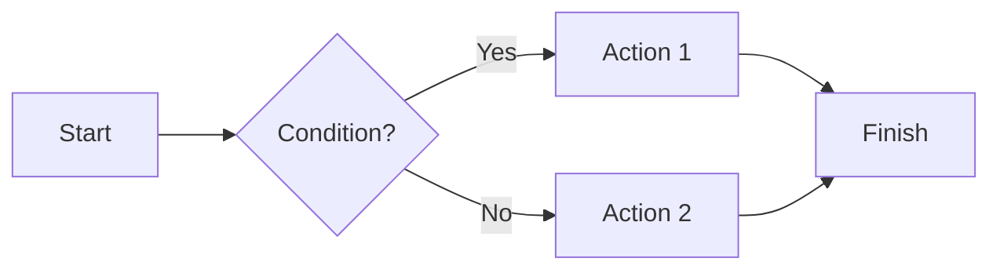
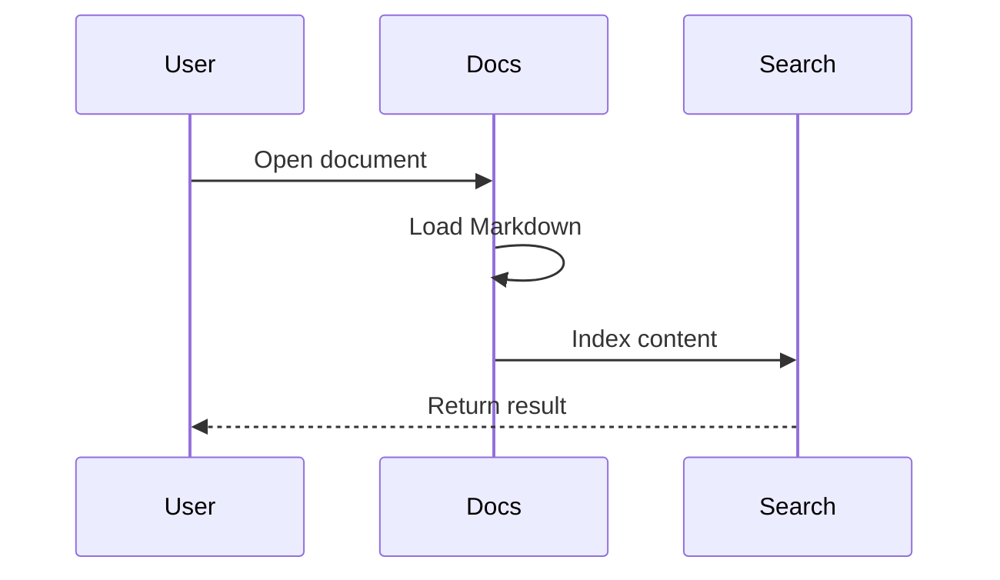
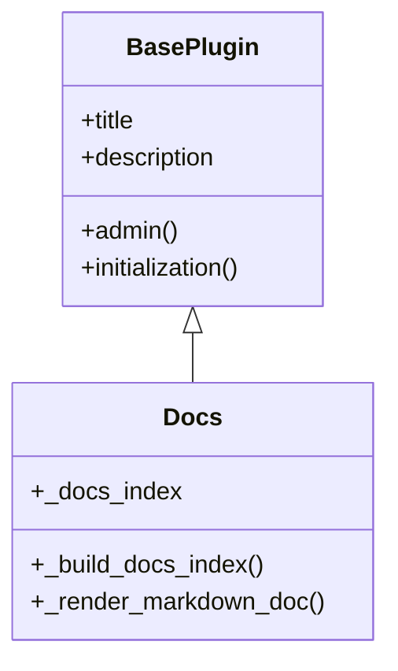
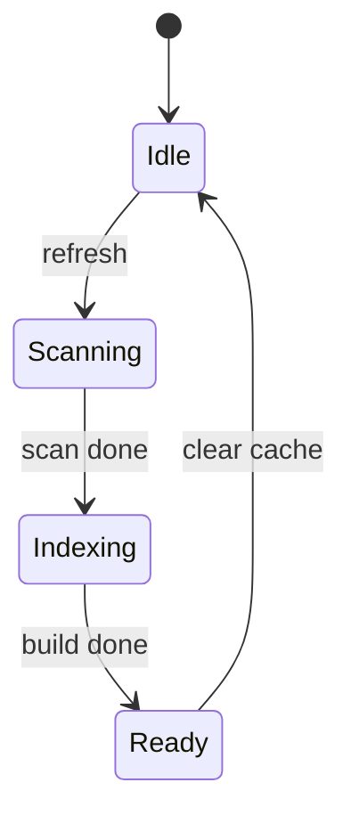
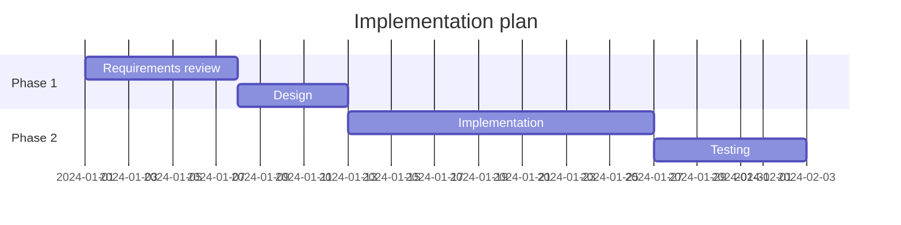
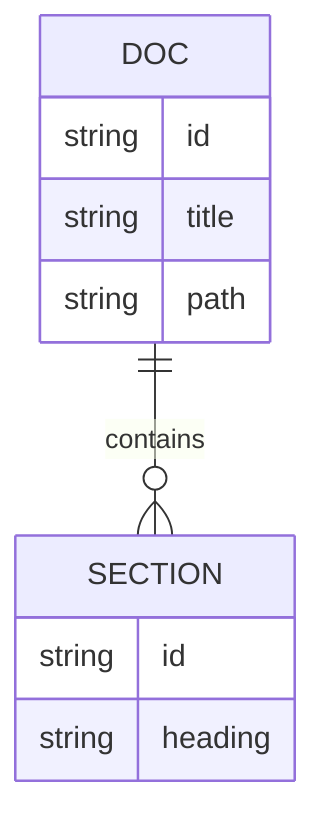
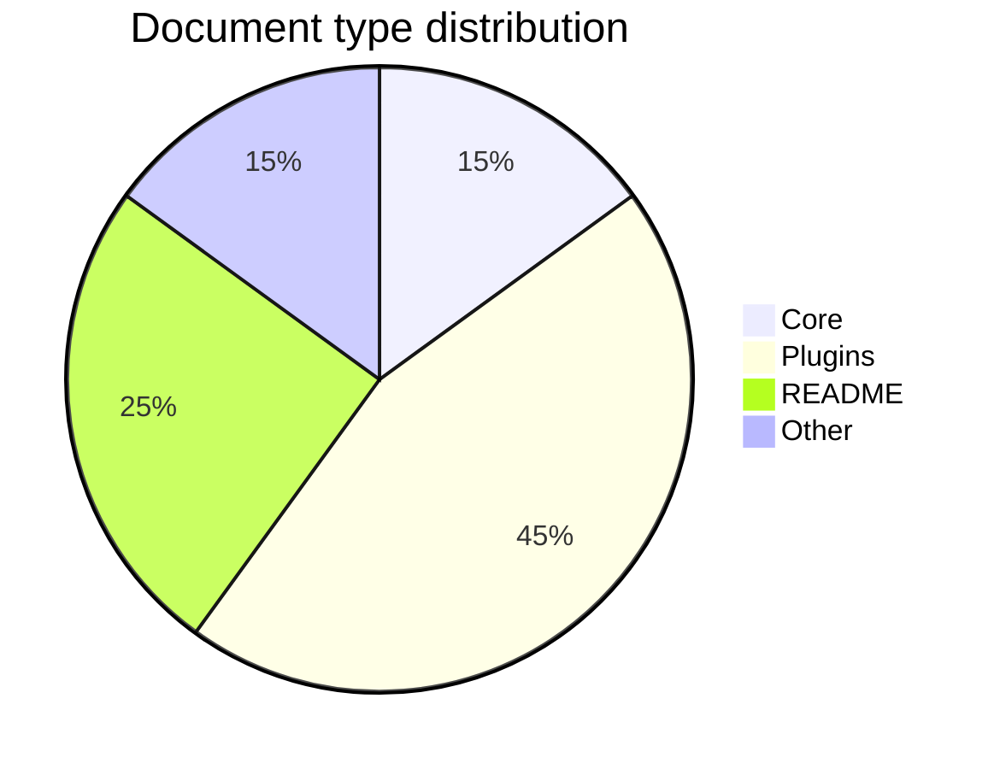

# Supported Markdown Syntax Examples

This page demonstrates the Markdown features supported by Docs. It covers GitHub Flavored Markdown, code blocks, tables, Mermaid diagrams, alerts, and additional rendering features.

---

## Headings

```markdown
# Heading 1
## Heading 2
### Heading 3
#### Heading 4
##### Heading 5
###### Heading 6
```

# Heading 1
## Heading 2
### Heading 3
#### Heading 4

---

## Text Formatting

- **Bold text** with `**bold**` or `__bold__`
- *Italic text* with `*italic*` or `_italic_`
- ***Bold italic*** with `***text***`
- ~~Strikethrough~~ with `~~text~~`
- `Inline code` with backticks
- Subscript: `H<sub>2</sub>O` -> H<sub>2</sub>O
- Superscript: `x<sup>2</sup>` -> x<sup>2</sup>
- Underline: `<ins>inserted text</ins>` -> <ins>inserted text</ins>

---

## Line Breaks

A line break in Markdown can be created in several ways:

- Two trailing spaces  
  next line

- A trailing backslash\
  next line

- An HTML break tag<br/>
  next line

A blank line starts a new paragraph.

---

## Lists

### Unordered

- Item 1
- Item 2
  - Nested item
  - Another nested item
- Item 3

### Ordered

1. First
2. Second
3. Third

### Task List

- [x] Completed item
- [x] Another completed item
- [ ] Pending item
- [ ] In progress

---

## Links and Images

### Links

Regular link: [GitHub](https://github.com)

Autolink: https://example.com

Link with tooltip: [Example](https://example.com "Tooltip text")

Relative document link: [DOCUMENTATION.md](DOCUMENTATION.md)

### Images

Basic syntax: ``

External image with explicit size:


With a title attribute:


Local asset relative to this document:


Asset from the plugin `static/` directory:


### Section Anchors

You can link to a heading inside the same document. Example: [Jump to code blocks](#code-blocks)

---

## Quotes

> This is a block quote.
> It can span multiple lines.

> Nested quote:
>> Level 2
>>> Level 3

---

## Code Blocks

### Plain

```text
simple code block
without syntax highlighting
```

### Highlighted

```python
def hello_world():
    """Simple greeting."""
    print("Hello, World!")

result = 42
```

```javascript
function greet(name) {
    console.log(`Hello, ${name}!`);
}
greet("Docs");
```

```json
{
  "name": "Docs",
  "version": 1,
  "features": ["markdown", "mermaid", "search"]
}
```

```yaml
server:
  host: localhost
  port: 8080
features:
  - markdown
  - mermaid
```

```bash
pip install cmarkgfm
pip install markdown2
```

```sql
SELECT id, title, path
FROM docs_index
WHERE source_id = 'Docs'
ORDER BY title;
```

---

## Tables

| Column 1 | Column 2 | Column 3 |
| --- | --- | --- |
| Cell A1 | Cell B1 | Cell C1 |
| Cell A2 | Cell B2 | Cell C2 |
| *italic* | **bold** | `code` |

### Alignment

| Left | Center | Right |
| :--- | :---: | ---: |
| Left | Center | Right |
| 1 | 2 | 3 |

---

## Mermaid Diagrams

### Flowchart



### Sequence Diagram



### Class Diagram



### State Diagram



### Gantt



### Entity Relationship



### Pie Chart



---

## Alerts

> [!NOTE]
> Helpful information that users should know.

> [!TIP]
> A suggestion that can make the task easier.

> [!IMPORTANT]
> Important information needed for success.

> [!WARNING]
> Something that deserves immediate attention.

> [!CAUTION]
> A warning about risks or negative outcomes.

---

## Footnotes

Footnotes are supported.[^1]

They can also be multiline.[^2]

[^1]: Example footnote text.
[^2]: Multiline footnote text.  
Add two trailing spaces to keep the line break.

---

## Color Tokens

Inline code can include color values:

- `#DA690A`
- `rgb(9, 105, 218)`
- `hsl(212, 92%, 45%)`

---

## Horizontal Rules

Three or more dashes, asterisks, or underscores:

---

***

___

---

## Jekyll Links

Docs supports Jekyll-style links inside Markdown links:

[Documentation link]()

---

## Inline HTML

<kbd>Ctrl</kbd>+<kbd>C</kbd> for copy.

<abbr title="HyperText Markup Language">HTML</abbr> as an abbreviation example.

---

## Escaping

Use `\` before special characters to prevent formatting.

Special characters: \* \_ \` \[ \] \( \) \# \. \!

Example: rename \*old-project\* to \*new-project\*.

---

## Hidden Content

HTML comments are not rendered:

<!-- This text will not be visible in the rendered document -->

---

## Support Summary

| Feature | Supported |
| --- | --- |
| H1-H6 headings | Yes |
| Bold, italic, strikethrough | Yes |
| Subscript, superscript, underline | Yes |
| Inline code | Yes |
| Line breaks | Yes |
| Fenced code blocks | Yes |
| Syntax highlighting | Yes |
| GFM tables | Yes |
| Ordered and unordered lists | Yes |
| Task lists | Yes |
| Links and images | Yes |
| Section anchors | Yes |
| Quotes | Yes |
| Alerts | Yes |
| Footnotes | Yes |
| Color tokens | Yes |
| Mermaid diagrams | Yes |
| Jekyll links | Yes |
| Relative `.md` links | Yes |
| Inline HTML | Yes |
| Escaping | Yes |
| HTML comments | Yes |
