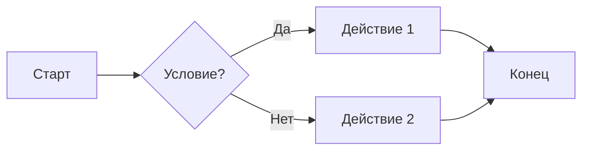
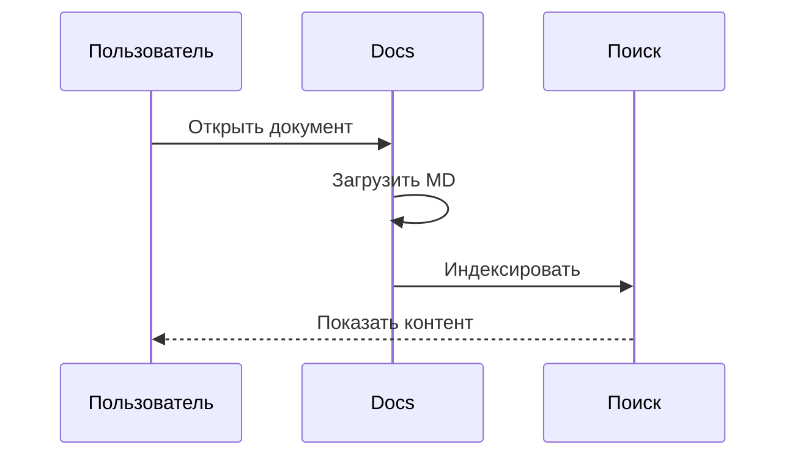
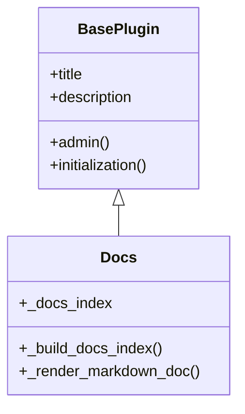
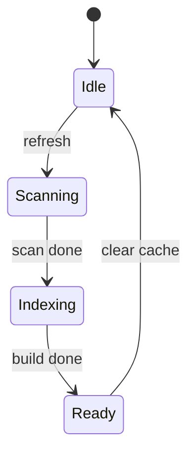
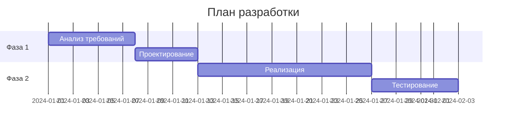
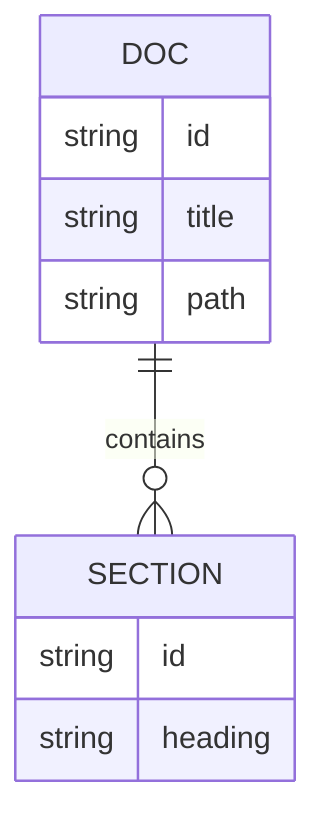
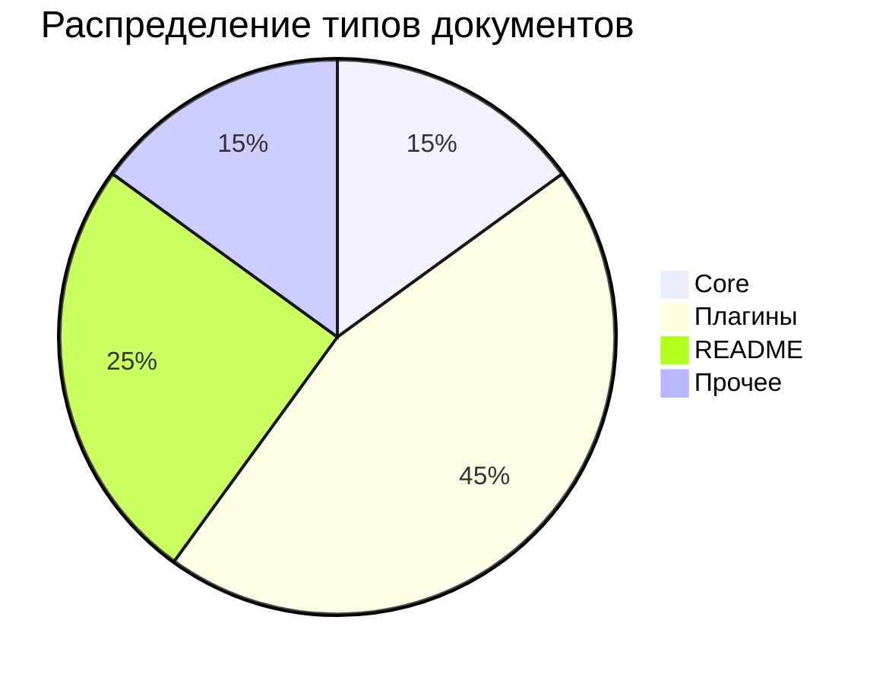

# Примеры поддерживаемого синтаксиса Markdown

Справочник всех возможностей рендерера документации: GitHub Flavored Markdown (GFM), блоки кода, таблицы, Mermaid-диаграммы и прочее.

---

## Заголовки

```markdown
# Заголовок 1
## Заголовок 2
### Заголовок 3
#### Заголовок 4
##### Заголовок 5
###### Заголовок 6
```

# Заголовок 1
## Заголовок 2
### Заголовок 3
#### Заголовок 4

---

## Текстовое форматирование

- **Жирный текст** — `**жирный**` или `__жирный__`
- *Курсив* — `*курсив*` или `_курсив_`
- ***Жирный курсив*** — `***текст***`
- ~~Зачёркнутый~~ — `~~зачёркнутый~~`
- `Инлайн-код` — обратные кавычки
- Нижний индекс — `H<sub>2</sub>O` → H<sub>2</sub>O
- Верхний индекс — `x<sup>2</sup>` → x<sup>2</sup>
- Подчёркивание — `<ins>вставленный текст</ins>` → <ins>вставленный текст</ins>

---

## Переносы строк

В `.md` файлах перенос создаётся одним из способов:

- Два пробела в конце строки  
  следующая строка

- Обратный слэш в конце строки\
  следующая строка

- Тег `<br/>` в конце строки<br/>
  следующая строка

Пустая строка между абзацами создаёт новый параграф.

---

## Списки

### Ненумерованный

- Пункт 1
- Пункт 2
  - Вложенный пункт
  - Ещё вложенный
- Пункт 3

### Нумерованный

1. Первый
2. Второй
3. Третий

### Список задач (task list)

- [x] Выполненная задача
- [x] Ещё одна выполненная
- [ ] Невыполненная задача
- [ ] В процессе

---

## Ссылки и изображения

### Ссылки

Обычная ссылка: [GitHub](https://github.com)

Автолинк: https://example.com

Ссылка с подсказкой: [Текст ссылки](https://example.com "Всплывающая подсказка")

Относительная ссылка на документ: [DOCUMENTATION.md](DOCUMENTATION.md)

### Изображения

Базовый синтаксис: ``

Изображение по внешней ссылке:


С подсказкой (атрибут title):


Локальный ресурс — путь относительно каталога документа (папка `images/` рядом с `.md`):


Путь к `static/` плагина (для Docs — иконка из корня плагина):


### Ссылки на разделы (якоря)

Можно ссылаться на заголовки в документе. Якорь формируется из текста заголовка: пробелы → дефисы, в нижнем регистре.

Пример: [Перейти к блокам кода](#блоки-кода)

---

## Цитаты

> Это блок цитаты.
> Можно писать на нескольких строках.

> Вложенная цитата:
>> Уровень 2
>>> Уровень 3

---

## Блоки кода

### Без указания языка

```
простой блок кода
без подсветки синтаксиса
```

### С подсветкой синтаксиса

```python
def hello_world():
    """Приветствие."""
    print("Hello, World!")

# Комментарий
result = 42
```

```javascript
function greet(name) {
    console.log(`Hello, ${name}!`);
}
greet("Docs");
```

```json
{
    "name": "Docs",
    "version": 1,
    "features": ["markdown", "mermaid", "search"]
}
```

```yaml
server:
  host: localhost
  port: 8080
features:
  - markdown
  - mermaid
```

```bash
# Установка зависимостей
pip install cmarkgfm
pip install markdown2
```

```sql
SELECT id, title, path 
FROM docs_index 
WHERE source_id = 'Docs' 
ORDER BY title;
```

---

## Таблицы

| Колонка 1   | Колонка 2   | Колонка 3   |
| ----------- | ----------- | ----------- |
| Ячейка A1   | Ячейка B1   | Ячейка C1   |
| Ячейка A2   | Ячейка B2   | Ячейка C2   |
| *курсив*    | **жирный**  | `код`       |

### Выравнивание

| По левому | По центру | По правому |
| :-------- | :-------: | ---------: |
| Left      | Center    | Right      |
| 1         | 2         | 3          |

---

## Mermaid-диаграммы

### Блок-схема (Flowchart)



### Диаграмма последовательности



### Диаграмма классов



### Диаграмма состояний



### Ганта



### Entity Relationship



### Pie chart



---

## Оповещения (Alerts)

Блоки цитат с особым синтаксисом для выделения информации:

> [!NOTE]
> Полезная информация, которую пользователю стоит знать.

> [!TIP]
> Совет для упрощения работы или улучшения результата.

> [!IMPORTANT]
> Важная информация для достижения цели.

> [!WARNING]
> Требует немедленного внимания во избежание проблем.

> [!CAUTION]
> Предупреждение о рисках или негативных последствиях.

---

## Сноски

Синтаксис сносок[^1] позволяет добавлять примечания внизу документа.

Сноска может быть многострочной[^2].

[^1]: Текст сноски.
[^2]: Многострочная сноска.  
Добавьте два пробела в конце строки для переноса.

---

## Модели цветов

В инлайн-коде можно указать цвет в форматах HEX, RGB, HSL — некоторые рендереры показывают визуализацию цвета:

- `#DA690A` — HEX
- `rgb(9, 105, 218)` — RGB
- `hsl(212, 92%, 45%)` — HSL

---

## Горизонтальная линия

Три или более дефисов, звёздочек или подчёркиваний:

---

***

___

---

## Jekyll-ссылки

Поддерживается синтаксис Jekyll `` внутри markdown-ссылок:

[Ссылка на документацию]()

---

## HTML (инлайн)

<kbd>Ctrl</kbd>+<kbd>C</kbd> — копирование.

<abbr title="HyperText Markup Language">HTML</abbr> — аббревиатура.

---

## Экранирование

Обратный слэш `\` перед спецсимволом отключает форматирование:

Специальные символы: \* \_ \` \[ \] \( \) \# \. \!

Пример: переименуем \*старый-проект\* в \*новый-проект\*.

---

## Скрытие контента

HTML-комментарии не отображаются в рендере:

<!-- Этот текст не будет виден в документе -->

---

## Сводка поддерживаемых возможностей

| Возможность | Поддержка |
| ----------- | --------- |
| Заголовки H1–H6 | ✓ |
| Жирный, курсив, зачёркнутый | ✓ |
| Subscript, superscript, underline | ✓ |
| Инлайн-код | ✓ |
| Переносы строк | ✓ |
| Fenced code blocks | ✓ |
| Подсветка синтаксиса | ✓ |
| Таблицы GFM | ✓ |
| Списки (нумерованные, маркированные) | ✓ |
| Task lists | ✓ |
| Ссылки и изображения | ✓ |
| Ссылки на разделы (якоря) | ✓ |
| Цитаты | ✓ |
| Оповещения (Alerts) | ✓ |
| Сноски | ✓ |
| Модели цветов (HEX, RGB, HSL) | ✓ |
| Mermaid-диаграммы | ✓ |
| Jekyll-ссылки | ✓ |
| Относительные ссылки на .md | ✓ |
| HTML (kbd, abbr, sub, sup, ins) | ✓ |
| Экранирование | ✓ |
| HTML-комментарии | ✓ |
